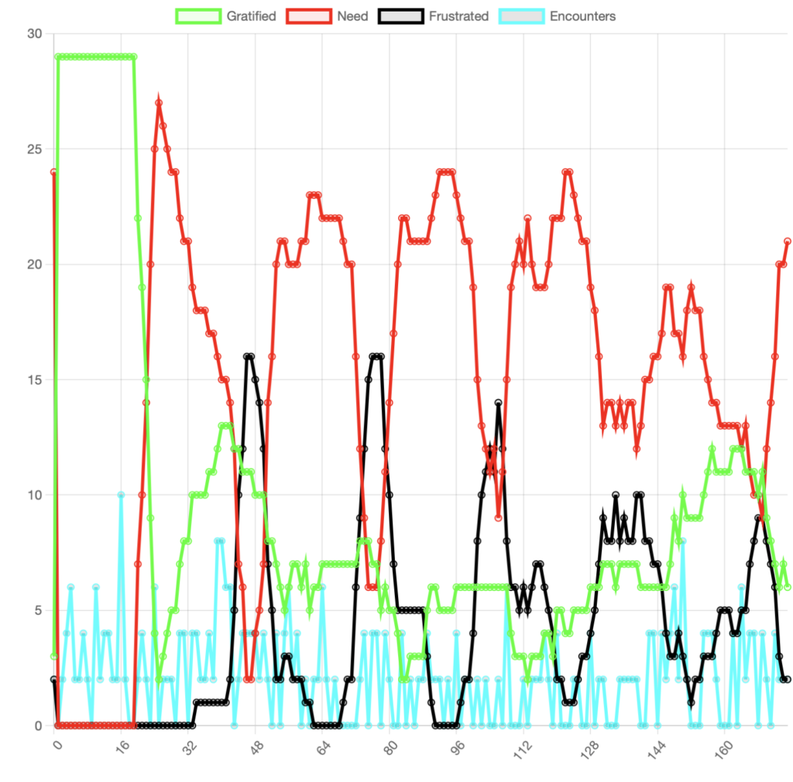

# systems-models

Models of collective behavior from the research of Jack Calhoun and Murray Bowen

## Mythematical Social Pool Game

Agent model of the first few paragraphs of Jack Calhoun's (rats of NIMH) "Mythematical Pool Game". Uses [Project Mesa](https://github.com/projectmesa/mesa), the excellent python / html5 agent modeling toolkit.

### TLDR;

`$ python run.py --models mythematical`

### Introduction

Here is an experimental agent model of the first two paragraphs of Jack Calhoun’s Mythematical Pool Game, published in his article Space and the Strategy of Life, 1971. It is made freely available so that anyone can experiment with some of the theoretical variables that Calhoun’s research suggested determined key characteristics of collective behavior in the rat populations he studied. It does only cover the first two paragraphs of Calhoun’s two-age description, but even these two first paragraphs contain a number of useful variables.

[Click here to try out the model](https://orca-app-mchd2.ondigitalocean.app/#)

The main goal of this particular model is to demonstrate how software models of emotional systems can be used to test out simulations against key independent variables. This is the first model to be built for the linked rich theoretical traditions of Calhoun and Bowen. Having some kind of an example of a tangible simulation model of such rich theoretical ideas is important to show how these theories can be formalized toward demonstrable evidence of theoretical concepts.

*Cycles in values of the dependent variables that emerge with certain settings in the independent variables.*

Also, there is substantial conceptual overlap between this model and the concepts in Bowen Theory. It includes a finite state machine describing the discrete changes between states having to do with comfort; gratification, need, frustration, very frustrated. The chances of interaction are random in order to control for these variables, though this would change given the rules of the frustration states.

*The finite state machine in Calhoun’s Mythematical Social Pool Game*

Take a look at the model, play around, and see what you observe at the level of emergent property. That is, see if you can tweak the independent variables in such a way as to produce certain patterns over time; all frustrated, all needy, all gratified, no pattern, etc. Click the “About” button at the top for a comprehensive description of the model. It includes some goals described by Calhoun.

Later versions will be published with the remaining paragraphs, but this is a start. Calhoun’s descriptions are directly portable into a software model. It is comprised of distilled descriptions of object rules that can be translated into computer code.

Bowen’s descriptions are not as portable to code. It isn’t yet clear why this is. It could be because the rules are not clear enough, not objective or falsifiable enough, are too complex to visualize, or that the right software engineer has not read them yet. But it is an open and important question as to what similar rules would be, and what similar software simulation models would look like.

This is an essential task for the development of Bowen Theory into become a scientific theory – the definition of these rules.

### Legend

*   Gratified: Green (not "stippled")
*   Need: Red
*   Frustrated: Black

### Some Goals

*   Equilibrium: From Calhoun: "...evolutionary equilibrium connotes an appropriate number of contacts per unit time per individual to maximize gratification, and as a by-product to produce an equivalent amount of frustration.",
*   Clumping: Calhoun observed rats not taking up available space even though overpopulation led them to clump in horrific fashion.
*   Universal Autism: All balls become frustated + deviant + avoidant (+ extinct w/ reproduction)

### Concessions

*   Calhoun does not define independent variables but implies them, for example "each enters a state...that lasts for some time after the encounter" (underline added).
*   "Velocity" is constant in Calhoun's description, but not here. While "speed" is constant @ 1 cell per step, direction is random to one adjacent cell per step.
*   It is not clear what "bent arrow" rerpesents in paragraph 1 for "Ball 'A'" in need state. Here need state does not affect the random movement.
*   Only one "encounter" is allowed per ball per step. Calhoun did not account for this practicality of 2D software.
*   Calhoun writes, "Purely by chance some balls will be frustrated more often than others." It is not clear whether this chance is determined by an independent variable, i.e. something innate to each ball, or if the chance is derived from velocity and interactions. This model assumes it is derived from velocity and interactions.

### Overlap with (Potential) Bowen Model

*   Thresholds of some unnamed currency gained or lost via more or less contact with others. (Self? Functional Self? Or just state machine?)
*   Potential "anxiety" variable. May require inclusion of "search path", i.e. direction in "velocity."
*   Potential "differentiation" variable. Conceptual overlap with "implicit model" idea which is probably required for differentiation across species.

### TODO

*   Find settings that don't only produce needy and frustrated balls.
*   Reproduction + inheritance (Some researcher's second sufficient condition).
*   "Away" moves by frustrated, necessary for autism.

### From _Space and the Strategy of Life_, by Jack Calhoun, 1971.

Consider several billiard balls on a table (Figure 5). Each has certain attributes. Each moves at a constant velocity, as if propelled by some inner force, The physical diameter of each is equal to that of every other ball. All move within a fixed space or area. How often one ball will on the average collide with another will depend upon these three factors, velocity, diameter and area, in relationship to the number of balls present in the area. Furthermore, each ball from time to time develops a need state for contacting some other ball in an equivalent need state. Ball "A" with a bent arrow indicating its path of movement represents such a ball in the need state of encountering another ball in a like state. As shown, it does encounter such a ball. Each then gains from the encounter; each enters a state which may be designated as gratification that lasts for some time after the encounter. Residing in this state of gratification is indicated by the balls becoming stippled. After a specified period of time elapses, each of the stippled balls will complete its stay in the gratification state and return to the state of needing further contact with other balls.

One such ball, "B", by chance encounters a ball which is still in the gratification state from a prior satisfactory encounter. This latter ball remains uninfluenced by the encounter with "B"; it remains stippled. However, its failure to interact appropriately to the needs of "B" transforms "B" into a state of frustration indicated by the ball becoming black. In like fashion, when another ball, "C", meets a ball in the frustration state, it too will be thrown into the state of frustration, in which it will remain for some period of time before returning to the original need state for contact. At all times every ball is in one of three states: in need of contact, gratified from a satisfactory contact, or frustrated from an unsatisfactory contact. Purely by chance some balls will be frustrated more often than others. The more these balls are frustrated, the more they will try to escape from the field, the area within which meaningful contacts might occur. They seek the side pockets of their area of habitation. Here they are not visible to view; their " dropping out" leads to a lowered estimate of their velocity in terms of the total path traversed in the contact opportunity area over extended periods of time.

Two other variables are involved, the intensity or strength of contact and the number of individuals inhabiting the area. Now let us assume that the balls have acquired the property of replicating themselves and of possessing a mechanism for passing to succeeding generations properties which will increase the likelihood of expression of appropriate behavior. The most important of these relates to the intensity of involvement at the time of contact. Depending upon the number of balls in the area, there is a specific intensity of contact which will maximize the amount of time spent in the state of gratification. This arises from the property of duration of remaining in refractory states of gratification or frustration being proportional to the intensity of contact. There is another peculiar consequence of life within such a system of contacts: balls will attempt to maximize the amount of time spent in the state of gratification. This attempt has the consequence of producing an equivalent amount of frustration. Since this is the nature of life, the genetic basis of physiology for its proper functioning comes to demand experiencing of equal amounts of frustration and gratification. Alterations from optimum group size, that is any change in the number of balls on the pool table of customary size, leads to an imbalance in fulfilling these two needs. When too few balls are present, the average ball will experience too little of both gratification and frustration. When the number of balls in the area reaches the square of the optimum number, every individual will essentially be frustrated as a result of every encounter since every other ball is essentially always in a frustrating refractory state. In this situation, every ball will develop maximal withdrawal, maximal reduction of velocity. No ball will have any awareness of any associate, even though they are crowded closely together. So far our experiments have not fully validated this conclusion, but they point in the direction of its correctness.

We call such balls by various names. Some are called mice, some rats, others man. Even fairly casual observation of such balls, each with its species-specific attributes, confirms the general validity of the above formulation. I call such simulations of more complex phenomena " Mythematical Games" . This term reflects a core conviction of mine--any particular expression of behavior as a sample of a wide range of possible variation is relatively meaningless, and even unintelligible. True appreciation of individual isolated episodes comes only from viewing them against the backdrop of a conceptual formulation never ever expressed as such. In this sense the concept is a myth which forms the only reality.

Let:

    A = area inhabited by N individuals

    v = average velocity of an individual through A

    d = target diameter of an individual

Where the individual is considered as a ball the target diameter is simply the diameter of the ball. In general, d encompasses any attribute which biases the probability that an individual will be detected and contacted by associates.

mu = communication constant reflecting the likelihood of contact

Then:

    mu = dv / A

        when a species is in evolutionary equilibrium

    mu = 1.0

that is to say: A = 1.0 and both d and v have the value, (A)^.5. Each will change over time symmetrically with A. When I say that a species is in evolutionary equilibrium, I mean that there is an optimum number of individuals inhabiting each unit of area, A. As a secondary abstraction, and a more meaningful one, evolutionary equilibrium connotes an appropriate number of contacts per unit time per individual to maximize gratification, and as a by-product to produce an equivalent amount of frustration.

Two other variables are involved, the intensity or strength of contact and the number of individuals inhabiting the area. Now let us assume that the balls have acquired the property of replicating themselves and of possessing a mechanism for passing to succeeding generations properties which will increase the likelihood of expression of appropriate behavior. The most important of these relates to the intensity of involvement at the time of contact. Depending upon the number of balls in the area, there is a specific intensity of contact which will maximize the amount of time spent in the state of gratification. This arises from the property of duration of remaining in refractory states of gratification or frustration being proportional to the intensity of contact. There is another peculiar consequence of life within such a system of contacts: balls will attempt to maximize the amount of time spent in the state of gratification. This attempt has the consequence of producing an equivalent amount of frustration. Since this is the nature of life, the genetic basis of physiology for its proper functioning comes to demand experiencing of equal amounts of frustration and gratification. Alterations from optimum group size, that is any change in the number of balls on the pool table of customary size, leads to an imbalance in fulfilling these two needs. When too few balls are present, the average ball will experience too little of both gratification and frustration. When the number of balls in the area reaches the square of the optimum number, every individual will essentially be frustrated as a result of every encounter since every other ball is essentially always in a frustrating refractory state. In this situation, every ball will develop maximal withdrawal, maximal reduction of velocity. No ball will have any awareness of any associate, even though they are crowded closely together. So far our experiments have not fully validated this conclusion, but they point in the direction of its correctness.

### Project MESA Notes

Here are some possible contributions to Project MESA to improve this model:
- Support multiple REST clients
- Support floating-point grid to approach physics simulation

## Bowen models:
- [bowen_1.py](models/bowen/bowen_1.py)
- [bowen_2.py](models/bowen/bowen_2.py)
- [bowen_3.py](models/bowen/bowen_3.py)
- [bowen_4.py](models/bowen/bowen_4.py)
